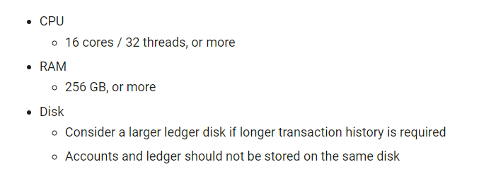
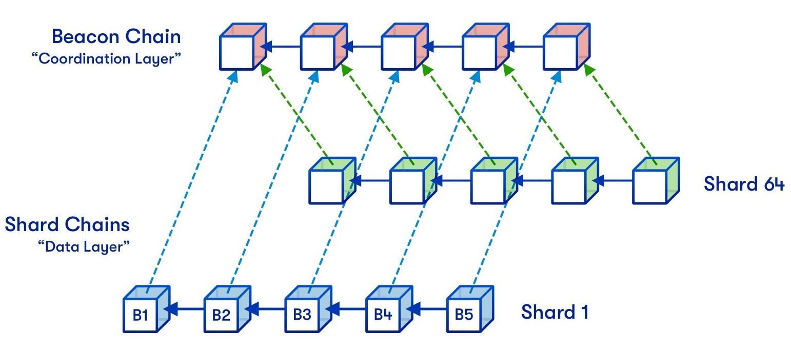
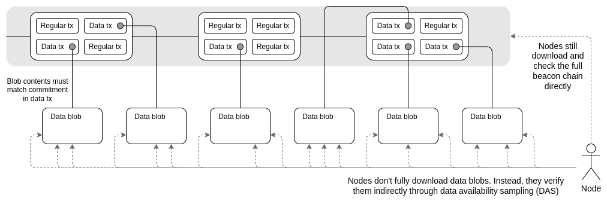

## Introduction

The rapid growth and widespread adoption of blockchain technology have recently sparked considerable interest in network scalability. As more users' and companies' claims grow in the industry, understanding the potential scaling solutions of these networks becomes increasingly important. This article aims to provide a comprehensive introduction to blockchain scalability and dispel common misconceptions surrounding the topic, so we can also spot wrong scaling solutions from new projects claiming to have solved the problem.

## What to do?

Before going into any scaling solution, it's worth saying that you can not scale a blockchain network just by what it is. Reducing the block time and tuning up the block size only makes the hardware requirements of running a node for the network higher. For example, Ethereum currently has a 12-second block time and roughly 1.5 MB block size, which brings a hardware requirement of 8 GB RAM and a duo-core CPU comparable to an average person's computer. Bitcoin, which has a 10-minute block time and a 1 MB block size, could even be run on a phone back in 2010! Now, let's take a look at Solana; it has a 0.5-second block time and a theoretically-possible 128MB block size, and here are the requirements to barely run a node for it:

    

Solana developers make it so that only the super-rich and datacenters can run nodes to gain performance! (For clarification, "nodes" are user nodes - a mini-server you use to sync and read data from the blockchain, not miners or validators!)

Not being able to run nodes makes the network centralized as users are **forced** to rely on centralized node providing services like Infura, Moralis, Quicknode, etc. The only way to scale up a blockchain is to move the heavy work out of the blockchain while having some connection to the chain and/or using cryptographic tricks so that even when tasks are not entirely done on the blockchain, it still works correctly and trustlessly.

Ideally, "good" scaling solutions are:
- "Decentralized" - People can perform that off-chain computation on their own, or there exists a network with many participants doing that for you, and this network must provide a reasonable way for people to join in (because that network is forever centralized to only those existing participants otherwise).
- "Secure" - There should not be any way or any reasonable way for an attacker or a centralized entity to attack and manipulate the protocol, and the security of the protocol *remains approximately the same even if the network scales up further.*

## State channels & Plasma

First, we will examine the two most straightforward "layer 2" scaling solutions - state channels and plasma chains.

### State channels

    

 

The basic idea of state channels is that, given a situation of a limited group of people wanting to transact with each other, you can deposit assets into a smart contract on-chain, write down planned transactions, compute the result at the end on your own, not on the blockchain, and only submit one final transaction to confirm this result on-chain with agreement from a *considerate* amount of the people in that group through their signatures (also known as a multisig). State channels are advantageous in cases where known parties have to make multiple transactions back and forth in a period since it reduces all tasks to only one or two transactions, and every channel's transaction being made is done instantly because it's not on-chain, but just a mutual short-term agreement between the parties. 

State channels are superior for large payments; people should use them to transfer money if they can because it is fast and cheap. It is just as fast as everyday payment applications that you are familiar with, and above all, you don't have to pay for any transfers made in state channels; the only thing you are paying for is channel creation/settlement on-chain. So if you make hundreds of money transfers, you pay for 1 or 2 transactions.

However, there are several drawbacks to such a protocol. It might not be helpful if only a few transactions are going on. Since it reduces `n` transactions to just 1 or 2 transactions, if you are making one transfer, it does not solve anything in that case. Furthermore, you can only make payments across a *limited group of people* due to the protocol's reliance on multi-sig to work. Suppose you expand it to a global level. In that case, faulty people might disagree with others to withdraw their assets, so such a system can only be used for 2-20 people. It is also impossible to build many types of applications just by using channels because, again, it's limited to a group of parties, so something like a complex decentralized lending protocol that relies on global consensus is impossible.

In practice, this scaling solution is prevalent among high-end Bitcoin users. Any serious Bitcoin user who has dug deep enough would know about Lightning Network and use it for everyday payments.

### Plasma chains

Another type of scaling solution limited to a group of parties is plasma chain. The basic idea is that you deposit some assets into the plasma protocol. You or any other party in the same transacting group keep transactions off-chain and post state commitment claiming the resulting state of those transactions to layer one periodically. If any party thinks the commitment is false, they create a dispute and submit proof that it is faulty. Ultimately, you can withdraw your assets corresponding to the current state commitment by submitting your account's state.

Plasma chains open up for more applications than state channels. Take chess, for example; state channels can not be used for such a purpose because it requires both players' signatures to get the game's result on-chain. Of course, the loser can deny submitting the signature for various reasons. With plasma chains, however, all moves are recorded off-chain; you can use that to construct a proof against the faulty state commitment (if it is faulty) or create an interactive dispute with the uploader on-chain. While state channels rely on a multi-sig, plasma chains rely on provable off-chain computation.

It does suffer from one big problem, though, which is data availability; if there is a loss of transactions or unclear transaction ordering, participants might not be able to submit proof on-chain against the faulty state commitment. This is also why it's limited to a group and can not be used globally. Still, we will see a very similar model in the next part of this article.

## Sharding & rollups

    

Another approach to scaling the blockchain is splitting it into many smaller chains, which reduces the overall computation and data storage needed for each of the chains, often called "sharding" or considered "rollups" - another type of layer two scaling solution.

### How **not** to shard

Sharding is often misunderstood cause many think it is just literally splitting one chain into child chains without doing anything extra. This would cause colossal consensus security concerns since having multiple chains performing a 51% attack with their consensus is much easier. If one child chain falls, the whole network falls. Another problem might be that those chains need to be connected, and communicating between the chains might be a complex problem.

### Then how do we shard?

The correct way to shard the chains is to use one chain as a consensus layer and then have multiple child chains (or "rollups") upload their transactions onto it. By doing this, no single child chain has to have its consensus, which means consensus security is not reduced. But the special part about this is that the child chains only care about their chain's transactions posted on the beacon chain and have their independent state. They do nothing with other chains' data; transactions from other chains are just there in the beacon block but ignored by them. By doing this, we have sharded transaction computation and state storage from one chain to multiple ones.

    

### Bridging

To bridge the token from the beacon chain to the rollup and reverse, usually, there are two classes of rollups to ensure the correctness of the state - Optimistic rollups and ZK rollups. Both upload a state root as a commitment to the global rollup's state; zk rollups will have a small-and-cheap-to-verify proof that can prove the correctness of a rollup block uploaded, while Optimistic rollups utilize a fraud-proof system, where a rollup block is considered truthy until someone says that it doesn't and challenges the person who uploaded the block. However, if there is not a native bridge from the rollup to layer one and reverse, these schemes are not needed; people often call this type of rollups "sovereign rollups" or "sovereign embedded chains," which are as independent as standard layer one but does not require any extra consensus security. However, it comes with a massive drawback of a lousy economy (because it will need its new unnecessary token) and insecure asset migration (cause the bridge is not native to the rollup, developers will have to build layer 1 to layer 1 type of bridges).

### Data sharding

But you might have noticed that the one thing we should have sharded is data availability (aka the block, the transaction batches, etc.). Even though everything is cheaper because state access/storage is lower, the amount of transactions handled by the entire network is the same since the block size is the same. We are just processing just as many transactions! We need to shard data availability (or DA for short) to scale up. The idea is that we will have special pieces of data on the beacon block called "blobs" and the cryptographic commitment of each of these blobs stored on each block. Rollups will upload their transaction batches as these blobs. The unique thing about this is that nodes will verify these blobs once against their commitment and then drop them, storing only the commitment. Rollups store their blobs and ignore others, but they can still request those blobs from other rollup nodes if they want to and verify them using the commitment stored. 

    

This is also where it is different from just increasing the block size; by increasing the block size, everyone has to store **all** of the big blocks and process **all** of the transactions. In this case, separate child chains deal with their small blocks and together add more throughput to the whole network. 

Through rollups and data sharding, transaction throughput will increase since more transactions can be handled without sacrificing huge computation costs. The only problem with this solution is that there are still the one-time data transportation cost and the cost to verify commitments, so we can only shard data availability to an extent.

Rollups and DA sharding are incredibly powerful because they have the same capability as a normal blockchain network. They are the only safe way to have a "multichain-ish" network.

### Compression tricks

Although this is not necessarily related to sharding, it's commonly used in Ethereum rollups to gain more capacity because DA sharding is not yet implemented in/before the time of writing, hence the name "rollups." If transactions are smaller, rollups can fit in more transactions.

To understand how this works, we must have a basic idea of a simple transaction; then, we will look at how each property can be compressed. 

* Nonce (~3 bytes): Entropy so that transactions have different signatures. This can be omitted entirely because we can get the current nonce directly from the state, which reduces 3 bytes.
* Gasprice (~8 bytes): How much a person would pay for 1 gas. We can make the user pay within a fixed range of gas prices, e.g., a choice of 16 consecutive powers of two, or it can be omitted entirely, and gas will be paid to block proposers using other sources like a state channel, which would get to 0-0.5 bytes.
* Gas (3 bytes): Amount of gas. We can either use the same trick as above or remove it entirely using a fixed-size gas, which would get to 0-0.5 bytes also.
* To (21 bytes): Receiver's address. We can make an account manager to reduce the receiver's address. An address will be registered with an index, and a reasonable index size would be somewhere 4 bytes which we can ensure that we would not be able to max out for several lifetimes.
* Value (~9 bytes): Amount to transact. We can use scientific notations for this, resulting in approximately 3 bytes.
* Signature (~68 bytes): Signature of the transaction. We can use BLS signature aggregation for this. The basic idea is that you can aggregate multiple signatures into only one signature. The cost is fixed to only one signature, which takes approximately 0.5 bytes per transaction.
* From (0 bytes): Sender's address. Initially, we can omit the sender's address because it can be recovered from the signature. Still, we need it to verify the aggregated signature in this case. So that's 4 bytes added.

(Taken from Vitalik's blog on rollups).

Overall, we have reduced a transaction with ~112 bytes to around ~12 bytes - almost a ten-time improvement in transaction capacity! 

In many cases of a zk rollup, some transaction fields can be removed entirely because they have already been proven through the zk proof, e.g., signatures.

### Going layer 3?

A wild thought would be to stack rollups on top of each other. While this may sound like an excellent idea, it just doesn't work because, in the end, data availability is the same, and no improvement in capacity is being added. However, we can build state channels and plasma chains on top of rollups.

## Cryptographic tricks

Cryptographic tricks refer to all sorts of cryptography usage in optimizing the blockchain. Here are some of the most popular use cases.

### ZK proof

There are three essential aspects in a blockchain: verification, execution, and data storage; succinct zk proof schemes like SNARKs or STARKs can improve efficiency in verification and execution, which results in more capacity gained.

### Data storage commitment

How would we deal with data storage, then? First, we will split it into two types of data storage, chain-related storage and application storage. Chain-related storage can only be optimized through the sharding tricks mentioned above, state data sharding through rollups, and then do data availability sharding. But in the case of application storage, we have a slightly different approach.

The idea is similar to what I have mentioned about DA sharding; you keep some cryptographic commitment on-chain, store data off-chain, and can then request the data from a p2p network like IPFS or a similar DHT protocol and verify it with the commitment stored. The only problem with this is that data is voluntarily stored. If your app has a large user base or a model that makes people host data behind the scenes, it will work, but otherwise, it wouldn't. A further approach would be to have a protocol similar to Sia, which pays hosts to store data, uses the same data sampling trick for proof of storage, punishes hosts if they don't store data, and incentivizes at download time in an *optimistic* way - paying accordingly to the data received so that they would provide data at any time.

## Optimizations

All of the things I have mentioned earlier are pretty abstract and general, in practice, protocol designs play a huge role in scalability. How you deal with data serialization, message gossiping, trie construction, stuff like segwit, parallel utxo transactions, etc can vastly reduce cost and improve overall transaction throughput. Optimization tricks to reduce data cost, disk io cost, pruning, etc from blockchain clients are also just as essential.

## Evade blockchain usage

Try to avoid blockchain usage as much as you can if you don't need to use a blockchain. Tasks like messaging or large data transfers should never be done on-chain; you should use a simple p2p network which is even more decentralized and infinitely faster.

## Better smart contract languages/compilers

While this may sound dumb, it is a fair point. Bad smart contract languages/compilers indirectly affect several blockchain networks' proper performance.

First, let's talk about contract execution. A lousy contract language design/compiler would produce unnecessary opcodes, meaning more execution is needed. For example, a contract written in Huff or Vyper (with their current official compilers) might be twice or three times more gas efficient than one written in Solidity (using the solc compiler). We don't even need to shard another chain or use another rollup in the first place for more efficiency if developers use those languages rather than Solidity.

Second, let's talk about contract code storage. Again, a bad contract language design/compiler would produce unnecessary opcodes, and that not only contribute to worse execution efficiency but also data storage cost for those contracts. A few months before the current time of writing, research showed that 10% of Solidity contracts in Ethereum are useless opcodes generated by the Solc compiler. Yep, tens of gigabytes of the Ethereum blockchain network currently are probably `solc` bloat, yikes!

People may not realize the damages a foul smart contract language may bring. Sure, it hurts apps' performance individually, but the problem is more complicated when a language is mass-adopted. A mass-adopted smart contract language with 3x more opcodes and 3x lower gas efficiency directly contributes to the network being three times less scalable than it could have been. We don't need to shard three extra chains; we need better smart contract language designs and compilers!

This solution does not help with scaling blockchains directly, as it does not add in any extra execution or data storage capacity, but rather helps recover the performance that they have lost due to unoptimized use of smart contracts and helps reduce chain bloat.

## Misconceptions

Here is a quick recap of the misconceptions we have covered:
- We can not just scale a blockchain by changing block size or block time.
- We can not do sharding by naively spawning new, unconnected chains/sidechains.

### Proof-of-stake improves scalability

A common misconception that most modern blockchain networks lie to users and investors about is that Proof-of-stake-based consensus is more scalable than Proof-of-work-based consensus or other consensus mechanisms. This is false since consensus protocols don't bring any extra transaction execution or data storage capabilities to the network; pos-based consensus protocols exist only as an energy-efficient way to achieve consensus compared to PoW mining. Most centralized blockchain networks with low block time and high block size will use PoS as an excuse for their performant **but** centralized network.

## Conclusion

I believe understanding blockchain fundamentals and possible blockchain scaling solutions is crucial for participants in this industry because not only can we have a better view of what the future of blockchain technology might look like, but we can also understand what's right and wrong, what's possible and what's limited so that people would not fall for projects that might exploit users' misconceptions for their goods, so there you go, thanks for reading!
